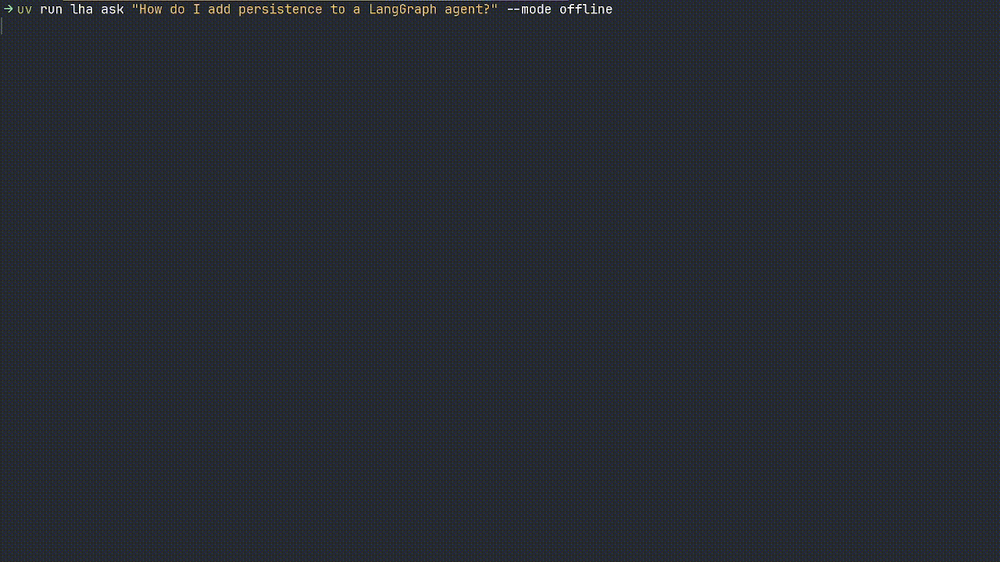

# LangGraph Helper Agent

AI assistant for LangGraph and LangChain documentation using RAG and web search.

> Built with **LangGraph v1 + LangChain core (V1 API)**. No deprecated LangChain APIs used.

## Setup

Install [uv](https://docs.astral.sh/uv/getting-started/installation/) if you don't have it:
```bash
curl -LsSf https://astral.sh/uv/install.sh | sh
```

Then:
```bash
uv sync
cp .env.example .env
```

Add your API keys to `.env`:
- `GOOGLE_API_KEY` - Required ([get key](https://aistudio.google.com/app/apikey))
- `TAVILY_API_KEY` - Optional, for web search ([get key](https://tavily.com/))

## Quick Start

```bash
# Download documentation
uv run lha download

# Ask a question
uv run lha ask "How do I add memory to a LangGraph agent?"
```

## Commands

### download

Download and sync documentation to vector store.

Sources:
- [LangGraph docs](https://langchain-ai.github.io/langgraph/llms-full.txt)
- [LangChain docs](https://docs.langchain.com/llms-full.txt)

```bash
uv run lha download           # Download + auto-sync changed docs
uv run lha download --force   # Force redownload all
uv run lha download --no-sync # Download only, no indexing
```

### ask

Ask questions about LangGraph/LangChain.

```bash
uv run lha ask "Your question"              # Default: offline (RAG only)
uv run lha ask "Your question" -m online    # Web search only
uv run lha ask "Your question" -m hybrid    # RAG + Web (parallel)
```

#### offline (RAG only)


#### online (Web search)


#### hybrid (RAG + Web parallel)


### reindex

Rebuild the entire vector store.

```bash
uv run lha reindex
```

## Configuration

All settings in `.env`:

| Variable | Default | Description |
|----------|---------|-------------|
| `GOOGLE_API_KEY` | - | Gemini API key (required) |
| `TAVILY_API_KEY` | - | Tavily API key (for online/hybrid) |
| `AGENT_MODE` | `offline` | Default mode: offline, online, hybrid |
| `LLM_MODEL` | `gemini-2.0-flash` | Model for generation |
| `REWRITE_MODEL` | `gemini-2.0-flash` | Model for query rewriting |
| `EMBEDDING_MODEL` | `models/text-embedding-004` | Embedding model |

## Demos

Interactive notebooks in `notebooks/`:
- `main_graph_demo.ipynb` - Full pipeline with all modes
- `web_graph_demo.ipynb` - Web search graph and tool

## Architecture

```
question → rewrite → [rag | web | both] → generate → answer
```

- **Rewrite**: Expands question into 3-5 optimized search queries
- **RAG**: Retrieves from local documentation (ChromaDB)
- **Web**: Searches via Tavily API
- **Generate**: Combines context and generates answer

Modes:
- `offline`: rewrite → rag → generate
- `online`: rewrite → web → generate
- `hybrid`: rewrite → [rag + web parallel] → generate

## Roadmap

- [ ] **Chat mode** - Interactive conversation with follow-up questions (`lha chat`)
- [ ] **Memory** - Conversation history persistence with LangGraph checkpointing
- [ ] **Streaming** - Real-time token streaming for faster perceived response
- [ ] **Reranker** - Rerank retrieved documents for better relevance (Cohere, cross-encoder)
- [ ] **Tests** - Unit and integration tests with pytest
- [ ] **More sources** - Add LangSmith, LangServe documentation
- [ ] **Code execution** - Run generated code examples in sandbox

## License

MIT
